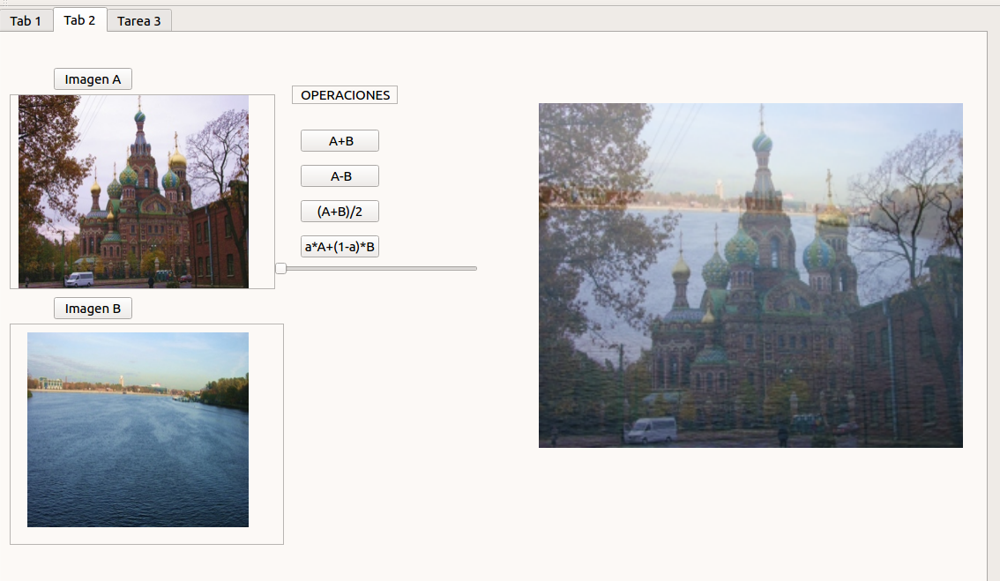

# Topicos_Grafica
#### Alumno: Condori Mamani Christian Erik.
### EJECUCION.
El proyecto se ejecuta en QTCreator. Importe y Ejecute(Proyecto02/proyecto02.pro).  
ERROR: si al momento de ejecucion da error, una de las causas podria ser la ruta de las imagenes que se estan abriendo. Si es asi, comentar y descomentar lo que se especifica en el archivo "mainwindow.h" en las lineas 31 y 50.  
Añada su imagen con los botones ABRIR o poniendo la ruta directamente en las lineas mensionadas anteriormente.
### Parte 1.
- Operaciones: Suma, Resta, Multiplicacion y Divicion.  
- Ecualizacion de Imagen.
- Binarizacion.

### Parte 2.
#### Operaciones entre imagenes.
- Operaciones: Suma, Resta, Media, Media Ponderada.

#### Operaciones entre imagenes.
- Operaciones: Suma, Resta, Media, Media Ponderada.

#### Operaciones entre imagenes.
- Operaciones: Suma, Resta, Media, Media Ponderada.

### Parte 3.
#### Combinacion de Imagenes.

